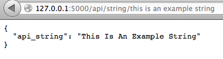
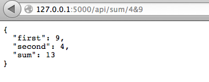

flaskAPIs
=========

Implementation of two simple REST APIs using Flask.
The first API accepts a string and returns the same string with the first letter of each word capitalized.
The second one accepts two numbers, swap them, sum them and returns the result of the sum.


>Web Service APIs that adhere to the REST constraints are called RESTful. RESTful APIs are defined with these aspects:

>    * base URI, such as http://example.com/resources/
>    * an Internet media type for the data. This is often JSON but can be any other valid Internet media type (e.g. >XML, Atom, microformats, images, etc.)
>    * standard HTTP methods (e.g., GET, PUT, POST, or DELETE)
>    * hypertext links to reference state
>    * hypertext links to reference related resources


### Setup
Install Python, Flask, Curl (not mandatory) in your environment following the official guides: 

* [http://www.python.org][1]
* [http://flask.pocoo.org/docs/installation/#installation][2]
* [http://curl.haxx.se/download.html][3]

Once downloaded the moviesRating project, open a terminal window and move to the project folder, then type: 
``` Bash
$ python flaskApi.py
``` 
You should see the following output:
``` Bash
* Running on http://127.0.0.1:5000/
* Restarting with reloader
``` 
Open another terminal and type (where "x" and "y" are the two numbers you want to swap and sum): 
``` Bash
$ curl -i 'http://localhost:5000/api/sum/x&y'
``` 
or
``` Bash
$ curl -i 'http://localhost:5000/api/string/this%20is%20a%20string'
``` 
where "this%20is%20a%20string" corresponds to the string 'this is a string'.
Otherwise you can just open a web browser and go to the corresponding url:





### Content
The project consists in two simple methods for implement the APIs, an error handler, and a "capitalizer" method.

``` Python
@app.route('/api/string/<string:api_string>', methods = ['GET'])
def get_string(api_string):
``` 
Passing it the string "hi my name is valerio" it will return the following Json output:
```
HTTP/1.0 200 OK
Content-Type: application/json
Content-Length: 43
Server: Werkzeug/0.9.4 Python/2.7.5
Date: Wed, 26 Feb 2014 21:41:40 GMT

{
  "api_string": "Hi My Name Is Valerio"
}
```

``` Python
@app.route('/api/sum/<int:first>&<int:second>', methods = ['GET'])
def get_sum(first,second):
``` 
Passing the numbers "5" and "12" it will return the following Json output:
```
HTTP/1.0 200 OK
Content-Type: application/json
Content-Length: 47
Server: Werkzeug/0.9.4 Python/2.7.5
Date: Wed, 26 Feb 2014 21:42:41 GMT

{
  "first": 12, 
  "second": 5, 
  "sum": 17
}
```


``` Python
@app.errorhandler(404)
def not_found(error):
``` 
Passing an invalid parameter to the API it will return:
```
HTTP/1.0 404 NOT FOUND
Content-Type: application/json
Content-Length: 26
Server: Werkzeug/0.9.4 Python/2.7.5
Date: Wed, 26 Feb 2014 21:44:29 GMT

{
  "error": "Not found"
}
```

``` Python
def titlecase(s):
``` 
This method takes a string and returns it back with the first letter of each word capitalized. I prefer the use of this method over the title() method because title() may not give the desired result with apostrophes in contractions and possessives form.


[1]: http://www.python.org
[2]: http://flask.pocoo.org/docs/installation/#installation
[3]: http://curl.haxx.se/download.html